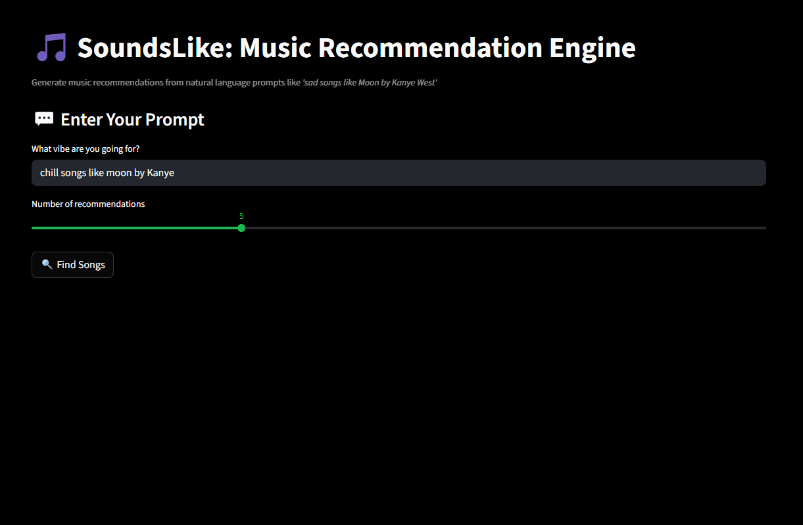
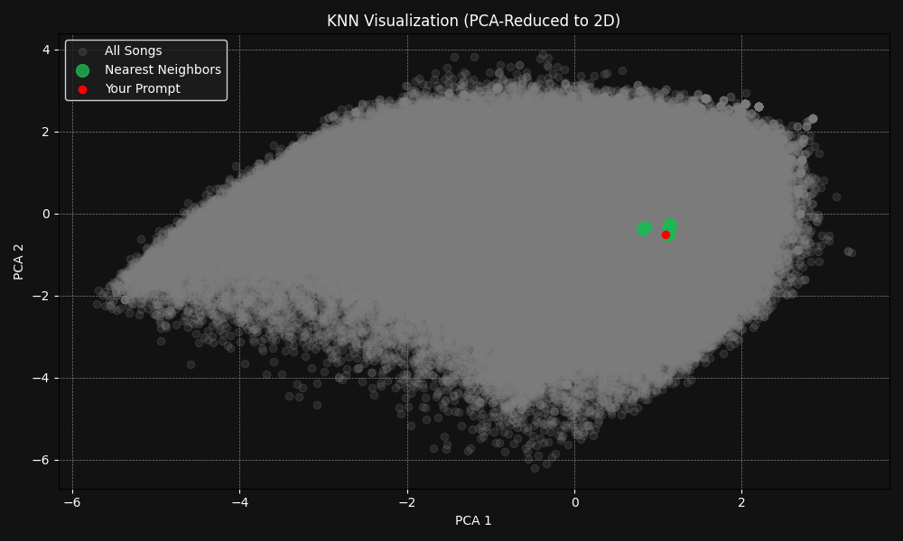
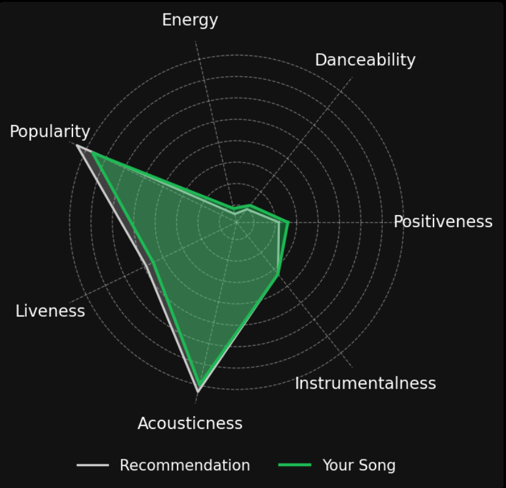

## Project overview

SoundsLike is a music recommendation system that takes your natural language prompts to suggest songs you might like. It combines a specified song, artist, and/or mood to find new music with similar characteristics.

Simply enter a prompt, adjust the number of recommendations you want, and get new songs that sound like your input!

**Example**: _"Chill songs like Moon by Kanye"_

## How it works

SoundsLike utilizes Natural Language Processing (NLP) for understanding user queries and Machine Learning (ML) techniques, such as embeddings, K-Nearest Neighbors (KNN), and vectorization, to find and visualize similar songs.

- It first uses Natural Language Processing (NLP) with a fine-tuned Named Entity Recognition (NER) model to understand your prompt and identify entities like the song, artist, or mood.
- The system then creates a temporary vector that numerically represents your input. This is done by finding a vector for the input song and artist (using a SentenceTransformer model) and combining it with a vector for the input mood.
- It then uses K-Nearest Neighbors (KNN) to find songs in the dataframe that have a vector closest to your input vector.
- Finally, the system visualizes the results by displaying the qualities of your input song versus the recommended songs in a radar chart and a 2D plot.

  
  

## Team/Contributors

- [Brandon Aguilar](https://github.com/brando008)
- [Yves Velasquez](https://github.com/HallowsYves)
- [May Chan](https://github.com/mchan78)

## Online repository

This was a rework of the original repo to 
for future reference. We have our full commit history and version of this app over there.

## Built with

